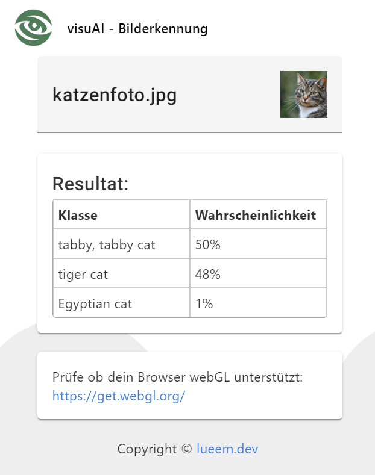

# visuAI - Image recognition



## Description

visuAI is an image recognition application that analyzes images and suggests the most likely categories.  
This project uses TensorFlow (MobileNet | WebGL) for image classification.

## Features

- **Image Classification:** Quickly identify objects in images.
- **High Compatibility:** Runs directly in your browser using TensorFlow.js.
- **Easy to Use:** Simple interface for uploading and analyzing images.

## Getting Started

### Prerequisites

- [Node.js](https://nodejs.org/) 
- [Angular CLI](https://angular.io/cli)

### Installation

1. Clone the repository:
   ```bash
   git clone https://github.com/nile4000/visuAI-frontend.git

2. Navigate into the project directory:
   ```bash
   cd visuAI-frontend

3. Install dependencies
   ```bash
   npm install

## Development Server

Run the development server:
    ```bash
    ng serve
    ```

Once the server is running, open your browser at http://localhost:4200/. The application automatically reloads when you modify any source files.

## Build

To create a production build:
   ```bash
   ng serve
   ```

## Support

If you have any questions or issues, please contact nile4000.

## License

This project is licensed under the MIT License.
